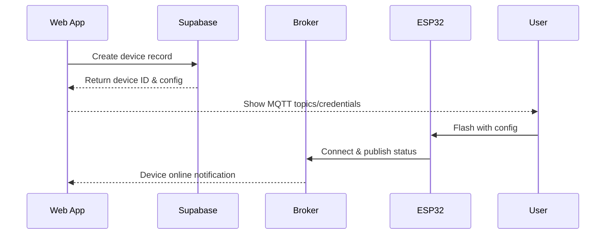
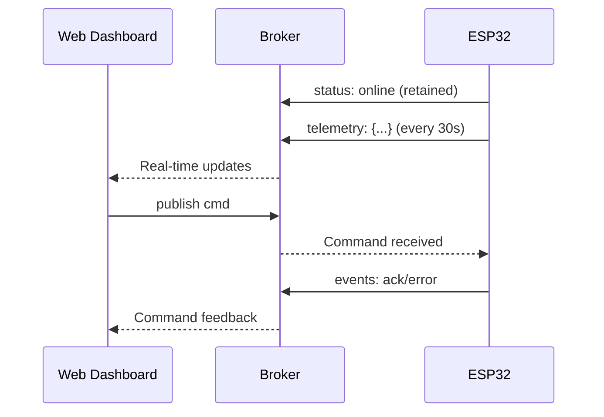
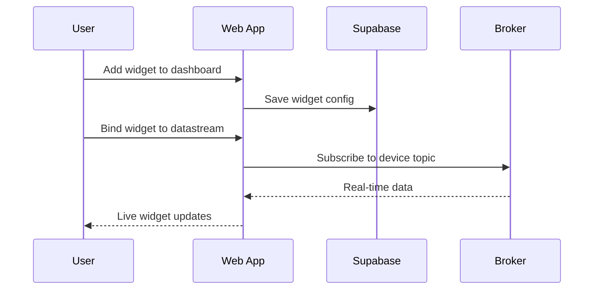

# SapHari System Flows

## Device Registration Flow

## Real-time Communication

## Dashboard Builder Flow

## System Limits

- Maximum 10 systems per user
- Enforced at database level with triggers
- UI shows current usage (X/10 systems)
- System creation blocked when limit reached